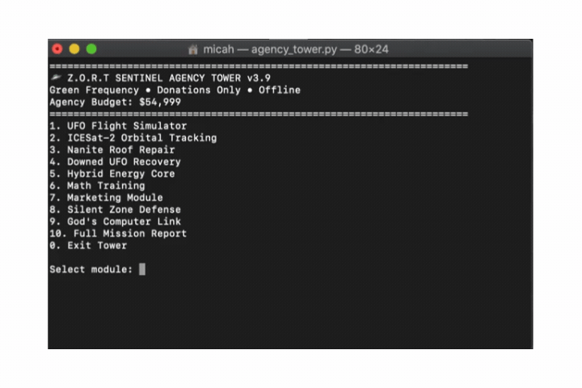

# Z.O.R.T Sentinel Agency Command Center 🛸

**Watch the tower running (auto-loops):**



------

**Offline Python terminal simulator** built for real mission work.

**Features:**
- UFO Flight Simulator (divine angle + stealth mode)
- ICESat-2 Orbital Tracking with real telemetry
- Nanite Roof Repair (storm tested)
- Downed UFO Recovery (God's Drone team)
- Hybrid Energy Core
- Math Training (aerospace)
- Silent Zone Defense
- God's Computer Link
- Full Mission Reports + realistic budget & expenses

**All runs completely offline** — no internet needed. Perfect for field use.

**Quick Start (Copy & Paste):**
```bash
git clone https://github.com/007tofreedom/zort-sentinel-tower.git
cd zort-sentinel-tower
python agency_tower.py
